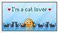
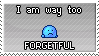

# Hi there 👋

👋 Hi, I'm Luís, currently studying Information Systems at UNIFESSPA.  
🌱 I’m currently focused on Web Development.
📫 How to reach me: [luispim2005@gmail.com](mailto:luispim2005@gmail.com)

---

## Skills 💻

- 🗣️ **Natural Languages**: Portuguese (Native), English (Advanced / Near-native)
- 👨‍💻 **Programming Languages**: Python, C#, Java, SwiftUI, JavaScript, GDScript
- 📱 **Markup & Styling**: HTML, CSS
- ⚒️ **Frameworks**: Java Spring Boot, Tail Wind, 

---

## Professional Experience 👨‍💻

- 🦎 **Exception Jr**: Junior Enterprise at UNIFESSPA, where I worked as a Full Stack Developer. (jul 2023 - now)
- 🌐 **Compass UOL**: Internship as a Developer. (may 2024 - oct 2024)
- 🦴 **Darling Ingredients**: Part-time job as an Office Assistant. (may 2023 - may 2024)
- 🎨 **Design Freelancer**: Created flyers, ads, posters, and other visual materials. (now)
- 🪛 **Technician Freelancer**: Computer assembly and small hardware/software repairs. (now)
- 🧑‍🏫 **IT Teacher**: Part-time teacher at UNIFESSPA, teaching a Computer Maintenance and Assembly course.  (nov 2024 - aug 2025)

---

## Hobbies 👾

- 🕹️ **Game Developer**: I love creating games in my free time and hope to turn this passion into a career one day ^^.  
  You can check out some of my projects on [**Itch.io**](https://caytie.itch.io/).
- 🪫 **Gaming**: I love games, love the MGS Series, and currently I'm addicted to Deadlock
- 🎥 **YouTube**: I love watching youtube, I have a small channel that I post on my free time, wont be sharing !!!!!!!!!
- 🍳 **Cooking**: I'm learning how to cook properly, tired of eating insta-ramen >.>

---

## Stamps

